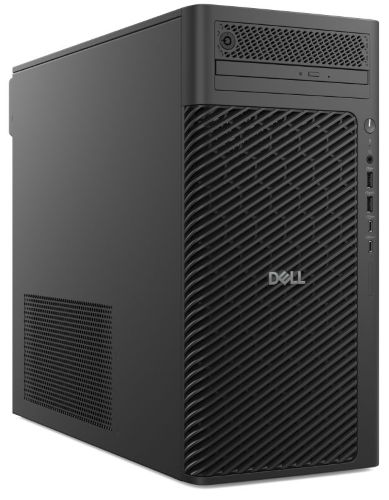

<HeroBlock bgColor="brand" imageAlign="right">

# Yritysten IT-laitteet

* Vakioidut ja yhteensopivat laitemallit käyttökuntoon asennettuina 
* Leasing tai suoraosto yrityksellesi sopivalla mallilla
* Kaikki yleisimmät laitemerkit - kilpailuta meidät
* Nopea apu ja arvio myös puhelimitse, soita <DisplayVariable variableKey="myynnin-puhelin" bold={true} />

*Tarvitsetko arvion IT-kokonaisuuden kustannuksista?*

<CallToAction bgColor="dark" url="https://www.tdp.fi/it-laitteet/arviolaskuri/" align="left">Kokeile laskuria</CallToAction>

<CallToAction bgColor="dark" url="#contact-form" align="left">Jätä tarjouspyyntö</CallToAction>

</HeroBlock>

# Dell Pro Max Tower T2

**Dell Pro Max Tower T2 on täysikokoinen, 32-litrainen tehotyöasema, joka on suunniteltu suorituskyvyn äärirajoille. Se on ensisijainen valinta insinööreille, data-analyytikoille, sisällöntuottajille ja 3D-suunnittelijoille, jotka eivät voi tinkiä laskentatehosta ja tarvitsevat huippuluokan suorituskykyä**.

Tämä on suunniteltu raskaaseen ajoon. Ainutlaatuinen **Unlimited Turbo Duration** -ominaisuus mahdollistaa sen, että 125 W:n prosessori voi toimia jopa **250 W:n** teholla pitkäkestoisesti, mikä takaa maksimaalisen nopeuden kriittisissä laskentatehtävissä ilman hidastumista. Yritysjohdolle laite tarjoaa turvaa **ISV-sertifioinneilla**, jotka takaavat ammattisovellusten (kuten CAD- ja mallinnusohjelmistot) vakaan toiminnan.

- - -

### **Tekoälykiihdytetty suorituskyky ja laajennettavuus**

Laitteen ytimessä sykkivät Intelin uusimmat prosessorit ja kone on erittäin kattavasti laajennettavissa, mikä tekee siitä pitkäikäisen investoinnin.

* **Prosessori ja NPU:** Varustettu Intel® Core™ Ultra -prosessoreilla (Series 2), joissa on integroitu NPU (Neural Processing Unit). Tämä nopeuttaa tekoälypohjaisten sovellusten toimintaa ja vapauttaa pääprosessorin resursseja.  
* **Grafiikka:** Tukee järeimpiä ammattitason näytönohjaimia aina **NVIDIA RTX 6000 Ada** -malliin asti, mikä tekee siitä erittäin tehokkaan renderöinnissä ja visualisoinnissa.  
* **Muisti ja Virheenkorjaus:** Jopa 128 GB DDR5-muistia. Tuki **ECC-virheenkorjaukselle** ja RMT Pro -teknologialle (Reliable Memory Technology) suojaa datan eheyttä, tunnistaa vialliset muistisektorit ja estää järjestelmän kaatumisia.  
* **Tallennustila:** Skaalautuu yrityksen datatarpeiden mukaan: tilaa jopa 12 TB SSD-tallennukselle tai 24 TB HDD-tallennukselle.

### **Liitettävyys ja joustavuus**

**Dell Pro Max Tower T2** mukautuu monimutkaisiinkin laiteympäristöihin.

* **Liitännät:** Laitteessa on vakiona kattava valikoima portteja, mukaan lukien nopeat USB 3.2 Gen 2x2 (20Gbps) Type-C -porti.  
* **Valinnainen moduuli:** Takapaneelin joustava porttimoduuli mahdollistaa räätälöinnin: siihen voidaan valita esimerkiksi Thunderbolt 4, HDMI 2.1, 5GbE LAN tai jopa kuituyhteys.  
* **Verkko:** Valmius Wi-Fi 7 -yhteyksille ja mahdollisuus kahteen Ethernet-kaapeliyhteyteen takaavat, ettei työskentely pysähdy verkon hitauteen.

### **Tietoturva ja kestävä kehitys**

Dell luokittelee laitteen yhdeksi maailman turvallisimmista kaupallisista tekoäly-PC:istä.

* **Suojaus:** BIOS- ja firmware-tason suojaus (Off-host verification) havaitsee laitteeseen kohdistuvat peukalointiyritykset. SafeID suojaa loppukäyttäjän tunnistetiedot erillisellä turvasirulla.  
* **Vastuullisuus:** Laite on suunniteltu kestävän kehityksen periaatteilla hyödyntäen kierrätysmuovia, merten muovijätettä ja suljetun kierron ITE-muovia.

- - -

### **Tekniset tiedot**

|                        |                                                                       |
| ---------------------- | --------------------------------------------------------------------- |
| **Suoritin**           | Intel® Core™ Ultra 5 / 7 / 9 (Series 2). Myös K-sarjan mallit (125W). |
| **Näytönohjain**       | Tuki jopa NVIDIA RTX 6000 Ada tai AMD Radeon Pro W7600.               |
| **Keskusmuisti**       | Jopa 128 GB DDR5 (ECC tai Non-ECC), 4400–5600 MT/s.                   |
| **Tallennustila**      | PCIe Gen4 / Gen5 NVMe SSD (M.2) ja 3.5" SATA/SAS HDD.                 |
| **Virtalähde**         | 360 W, 500 W tai 1500 W (80 PLUS Platinum).                           |
| **Laajennuspaikat**    | 4 x PCIe-paikkaa (sis. Gen5 x16), M.2-paikat SSD:lle ja Wi-Fi:lle.    |
| **Mitat & Paino**      | 387.00 x 187.70 x 438.00 mm. Paino max 23 kg.                         |
| **Etupaneelin portit** | USB-C 2x2 (20Gbps), USB-C (10Gbps), 2x USB-A (5Gbps), Audio.          |
| **Käyttöjärjestelmä**  | Windows 11 Pro                                                        |

- - -

Dell Pro Max Tower T2 on työkalu heille, jotka tekevät tulosta laskentateholla. Asiantuntijamme auttavat mitoittamaan juuri oikeanlaisen kokoonpanon (CPU, GPU, ECC-muisti) ohjelmistojenne vaatimusten mukaisesti. Toimitamme laitteet käyttövalmiina.
