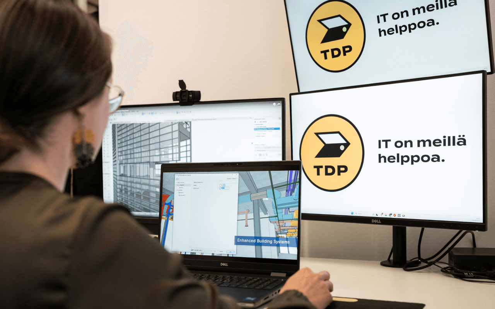
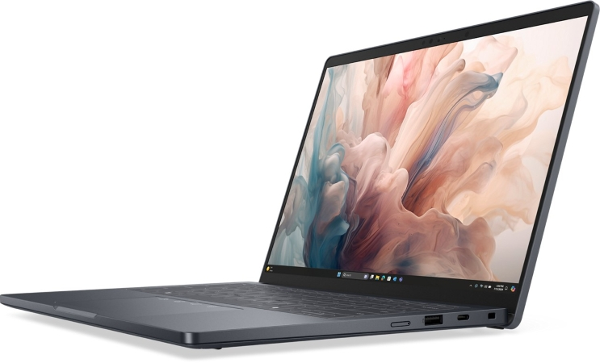

<HeroBlock bgColor="brand" imageAlign="right">

## IT-laitteet ja ratkaisut yrityskäyttöön

* Kannettavat, työasemat ja oheislaitteet kilpailukykyiseen hintaan
* Verkkolaitteet, infonäytöt ja neuvottelutilojen laitteet käyttökuntoon asennettuina
* Leasing tai suoraosto yrityksellesi sopivalla mallilla
* Paikallinen asiantuntija tukena koko laitteiden elinkaaren ajan
* Kaikki yleisimmät laitemerkit - kilpailuta meidät

</HeroBlock>

# Dell Pro Premium

**Tämä sarja  on suunnattu yrityksen vaativimmille käyttäjille: johtajille, konsulteille ja paljon matkustaville asiantuntijoille. Se korvaa aiemman Latitude 7000 -sarjan ja edustaa Dellin ohuimpia ja kevyimpiä ammattilaiskannettavia.**

Runko täyttää MIL-STD-810H-standardin vaatimukset, mikä tekee siitä erinomaisen valinnan paljon liikkuvalle käyttäjälle. Lisäksi Dell Pro 14 Premium on maailman ensimmäinen kaupallinen PC, joka on varustettu modulaarisella USB-C-portilla. Tämä mahdollistaa jopa neljä kertaa paremman vääntölujuuden ja jopa 33 kertaa paremman iskunkestävyyden, mikä parantaa laitteen kestävyyttä ja mahdollistaa helpommat korjaukset. Laitteen modulaarinen emolevy sekä I/O-kortti takaavat helpommat huoltotoimenpiteet ja vähentävät elektroniikkajätettä.

- - -

### **Tekninen suorituskyky ja AI-valmius (Copilot+ PC)**

Dell Pro Premium on ns. **AI-PC**, joka on rakennettu Intelin uusimman teknologian ympärille maksimoimaan energiatehokkuus ja suorituskyky.

* **Prosessori:** Laitteissa on Intel® Core™ Ultra -suorittimet (Series 2 / "Lunar Lake"), jotka on optimoitu tekoälylle. Integroitu NPU (Neural Processing Unit) mahdollistaa raskaiden tekoälykuormien ja Windows Copilot+ -kokemusten ajamisen suoraan laitteessa ilman pilviviivettä.  
* **Muisti:** Jopa 32 GB LPDDR5x-muistia (8533 MT/s), joka on integroitu suoraan prosessoripakettiin (Memory on Package). Tämä vähentää virrankulutusta ja nopeuttaa tiedonsiirtoa, mutta huomioitavaa on, että muisti ei ole jälkikäteen laajennettavissa.  
* **Jäähdytys:** Uusi kaksoistuuletinjärjestelmä lisää ilmavirtaa 20 %, pitäen laitteen viileänä ja hiljaisena myös kuormituksen alla.

### **Ensiluokkainen käyttökokemus ja AV-tekniikka**

Hybridityössä laadukas kuva ja ääni ovat välttämättömyys, eivät lisävaruste. Dell Pro Premium vie ne uudelle tasolle.

* **Kamera:** Markkinoiden ainoa yrityskannettava, jossa on vakiona **8 MP + IR HDR -kamera**. Se takaa kristallinkirkkaan kuvanlaadun ja tukee Windows Hello -kasvojentunnistusta sekä läsnäolontunnistusta (ExpressSign-in).  
* **Ääni:** Neljän kaiuttimen järjestelmä (kaksi ylöspäin ja kaksi alaspäin suunnattua) tuottaa jopa 29 % voimakkaamman äänen aiempaan verrattuna, mikä selkeyttää neuvottelupuheluita.  
* **Näppäimistö:** Uusi "Zero-Lattice" -näppäimistö on varustettu virtaa säästävällä Mini-LED-taustavalolla, joka vähentää virrankulutusta jopa 75 % ja pidentää akunkestoa tunneilla.

### **Näyttö ja liitettävyys**

Kompaktista koostaan huolimatta laite ei tingi liitännöistä tai kuvanlaadusta.

* **Näyttö:** 14-tuumaiseen malliin on saatavilla huippuluokan **Tandem OLED** -kosketusnäyttö (QHD+), joka tarjoaa täydellisen mustan ja eloisat värit ammattikäyttöön.  
* **Portit:** 2 x Thunderbolt 4 (USB-C), 1 x USB-A 3.2 Gen 2, HDMI 2.1 ja 3.5mm ääniliitäntä. USB-C-portit ovat modulaarisia ja vaihdettavissa.  
* **Yhteydet:** Wi-Fi 7 (BE201) ja Bluetooth 5.4 takaavat nopeimmat mahdolliset langattomat yhteydet. Valinnainen 5G-modeemi pitää sinut verkossa myös tien päällä.

- - -

### **Tekniset tiedot**

|                       |                                                 |     |
| --------------------- | ----------------------------------------------- | --- |
| **Runko**             | Magnesium (Magnetite-väri)                      |     |
| **Suoritin**          | Intel® Core™ Ultra Series 2 (vPro)              |     |
| **Näytönohjain**      | Integroitu Intel® Arc™ 130V/140V   130V/140V    |     |
| **Muisti**            | Jopa 32 GB LPDDR5x (integroitu)    (integroitu) |     |
| **Tallennustila**     | Jopa 2 TB PCIe Gen4 NVMe SSD                    |     |
| **Näyttö**            | 13.3" FHD+ tai QHD+                             |     |
| **Paino**             | Alkaen 1.07 kg                                  |     |
| **Akku**              | 40 Wh tai 60 Wh                                 |     |
| **Käyttöjärjestelmä** | Windows 11 Pro                                  |     |
