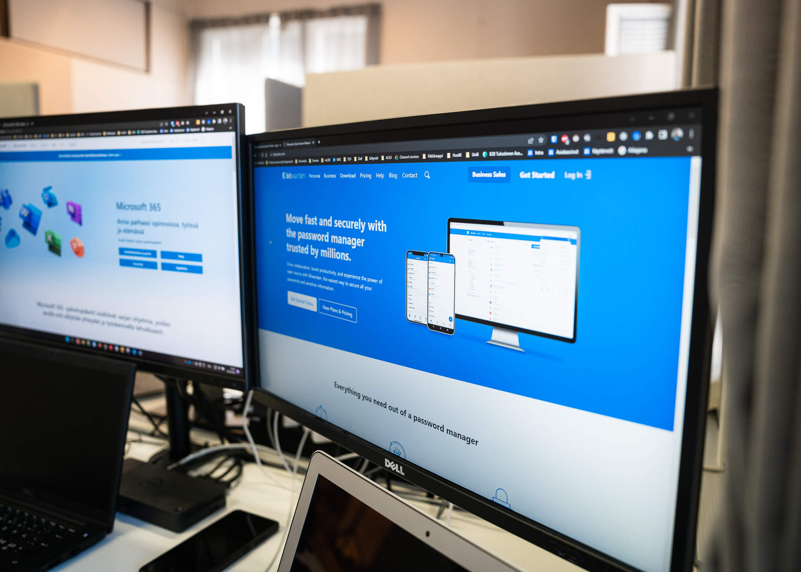

<HeroBlock bgColor="brand" imageAlign="right">

# Ohjelmistot yrityskäyttöön

* Tehokkaat työsovellukset kuten **Google Workspace** ja **Microsoft 365** tekevät työstä helpompaa ja tuottavampaa
* Tunnetuimpien työsovellusten lisäksi saatte meiltä muutkin ohjelmistot yrityksenne arkeen. Esimerkiksi **Adobe Creative Cloud, AutoCAD, Bitwarden sekä kotimaiset Nexetic ja WithSecure** ovat vahvoja tuotteita, joiden varaan voitte avullamme rakentaa yrityksenne digitaaliset prosessit
* * **Ohjelmistotarjontamme ei rajoitu näihin, vaan voimme tarjota yrityksellenne juuri tarpeidenne mukaisen ohjelmiston kulloiseenkin tarpeeseen**

</HeroBlock>

<Cards cardsPerRow="3" cards='[{"bgColor":"lightest","title":"","linkBgColor":"brand","content":"Google Workspace on monipuolinen digitaalinen työympäristö, joka sujuvoittaa yrityksesi liiketoimintaa. Workspace on turvallinen pilvipalvelu hyödyllisillä työsovelluksilla, johon saat TDP:ltä jatkuvan, ripeän käyttötuen.","linkText":"Lue lisää","link":"/ohjelmistot/google-workspace","image":"/assets/3.png"},{"bgColor":"lightest","title":"","linkBgColor":"brand","content":"Microsoft 365 -työympäristö vapauttaa työntekoa ja vähentää kustannuksia tietoturvaa unohtamatta. Tarjoamme saman Microsoft 365-ohjelmistopaketin yrityksellesi kuin kilpailijamme, mutta muita paremmalla käyttäjätuella.","linkText":"Tutustu tarkemmin","link":"/ohjelmistot/microsoft-365","image":"/assets/5.png"},{"bgColor":"lightest","title":"","linkBgColor":"brand","content":"Dropbox Business on tehokas yhteistyöalusta, joka auttaa PK-yrityksiä työskentelemään paremmin yhdessä, nopeasti. Dropbox Business -tiimit pääsevät tiedostoihin käsiksi milloin ja missä vain!","linkText":"Lue lisää","link":"/ohjelmistot/dropbox","image":"/assets/2.png"},{"bgColor":"lightest","title":"","linkBgColor":"brand","content":"Haluatko hallita yrityksesi kaikkia laitteita, työntekijöiden tunnuksia ja oikeuksia korkealla tietoturvalla yhdestä paikasta? Pilvipohjainen JumpCloud-ohjelmisto on erinomainen kokonaisratkaisu.","linkText":"Tutustu","link":"/it-palvelut/keskitetty-hallinta","image":"/assets/4.png"},{"bgColor":"lightest","title":"","linkBgColor":"brand","content":"Nira on reaaliaikainen pääsynhallintajärjestelmä, jolla hallinnoidaan yrityksen dokumentteja Google Workspacessa. Yli 50 hengen kasvaville organisaatioille loistava 3-in-1 ratkaisu.","linkText":"Lue lisää","link":"/ohjelmistot/nira","image":"/assets/6.png"},{"bgColor":"lightest","title":"","linkBgColor":"brand","content":"Hanki kontrolli yrityksesi liikkuvalle datalle salaamalla! Virtru on sähköpostien salaamisen edelläkävijä, jolla suojaat helposti niin Gmail- ja Outlook -viestit kuin niiden liitetiedostot.","link":"/ohjelmistot/virtru","linkText":"Lue lisää","image":"/assets/1.png"},{"bgColor":"lightest","title":"","linkBgColor":"brand","image":"/assets/assently-transparent-ohjelmistot-logot-285x40.png","content":"Assently on helpon sähköisen allekirjoituksen ja vankan henkilöllisyyden tunnistamisen tarpeisiin luotettava pohjoismainen vaihtoehto. Ja säästät valtavasti aikaa!","link":"/ohjelmistot/assently","linkText":"Lue lisää"},{"bgColor":"lightest","title":"","linkBgColor":"brand","image":"/assets/withsecure-logo.png","link":"/ohjelmistot/withsecure","linkText":"Hanki turvaa","content":"WithSecure™ on kattava suomalainen tietoturvaohjelmisto yrityksille, jotka haluavat taata tietojensa ja verkkojensa turvallisuuden parhaimmalla teknologialla."}]' />
