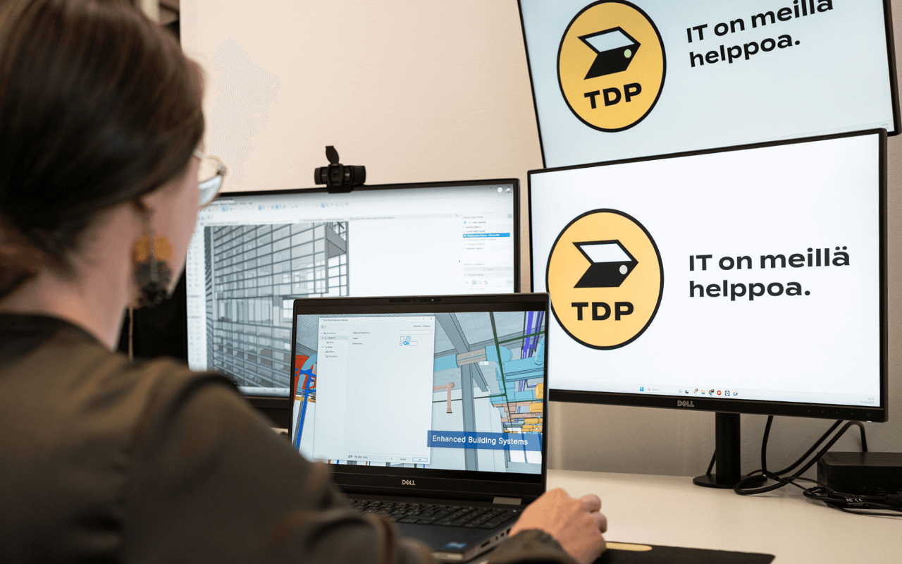
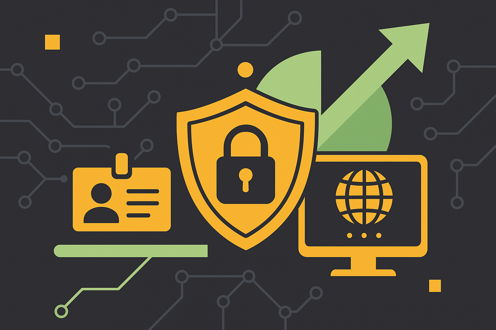

# TDP tarjoaa yrityksellesi oman IT-osaston

Yrityksen alkuvaiheessa päätöksiä riittää, eikä vähiten IT:n osalta. Ohjelmistot, tietoturva, laitteet ja palvelut muodostavat perustan, joka vaikuttaa sekä sujuvuuteen, että kustannuksiin. Kun asiat suunnitellaan kerralla fiksusti, se säästää aikaa, rahaa ja hermoja.

Tarjoamme tarvittavat ohjelmistot, laitetoimitukset ja kattavan valikoiman IT -palveluja, jotka voidaan mitoittaa juuri tarpeiden mukaan:

* **[Laitetoimitukset](/it-laitteet/) ja [leasing](/tietokone-leasing)**: Tietokoneet, puhelimet ja lisälaitteet. 
* **Sähköpostit ja kotisivut**: Sivut ja sähköpostit yrityksen omalla domainilla.
* **[IT-tuki ja ylläpito](/it-palvelut/tuki-ja-huolto)**: Etätuki, puhelintuki ja tarvittaessa apu paikan päälle.
* **Liiketoimintasovellukset**: [Microsoft 365](/ohjelmistot/microsoft-365), [Google Workspace](/ohjelmistot/google-workspace) tarjoavat kattavan valikoiman tuottavuustyökaluja
* **[Tietoturvapalvelut](/it-palvelut/tietoturva-total-ja-lite)**: Kattavat virus- ja haittaohjelma suojaukset
* **[Pilvipalveluiden varmuuskopiointi](/it-palvelut/varmuuskopiointi)**: Kustannustehokas tapa varmistaa tiedot 

Erityisesti yrityksen kasvaessa hyödyt myös seuraavista:

* **[Keskitetty hallinta](/it-palvelut/keskitetty-hallinta)**: Yksi näkymä koneisiin, käyttäjiin ja kirjautumisiin.
* **[KyberAkatemia](/it-palvelut/tdp-kyberakatemia)**: Tietoturvakoulutus työntekijöille. Helppoa, tehokasta ja jatkuvaa.

## Tärkeimmät IT -perustukset kuntoon heti alussa

Yrityksen toiminta rakentuu laitteiden, yhteyksien ja ohjelmistojen varaan. Kun nämä asiat suunnitellaan kunnolla jo alkumetreillä, vältytään turhilta harmeilta myöhemmin ja liiketoiminnan kehittämiseen jää enemmän aikaa.

### Laitteet: tietokoneet, puhelimet ja muut välineet

Käytännössä jokainen yritys tarvitsee vähintään yhden tietokoneen ja älypuhelimen. Usein tarvitaan myös lisälaitteita, kuten tulostimia, neuvottelulaitteita tai infonäyttöjä. Tärkeää on arvioida käyttöympäristö ja kuormitus: esimerkiksi graafinen suunnittelu, CAD-suunnittelu tai videoeditointi vaativat tehoa eri tavalla kuin kevyt toimistotyö.

Laitehankinnoissa vaihtoehtoina on joko ostaminen tai [leasing](/tietokone-leasing). Leasing-sopimus on erityisesti uusille yrityksille houkutteleva, koska se jakaa kustannuksia ja mahdollistaa laitteiden säännöllisen uusimisen.Tarjoamme molemmat vaihtoehdot sekä tarvittavat huolto-, päivitys- ja tukipalvelut.

### Internet ja puhelinyhteydet

Luotettava internet-yhteys on arjen perusta. Olitpa kotitoimistolla tai vuokratilassa, varmista että netti toimii nopeasti ja vakaasti. TDP voi auttaa valitsemaan sopivan liittymän ja hoitaa samalla toimiston verkkolaitteet kuntoon.

Puhelinliittymien osalta kannattaa miettiä, tarvitaanko yritykselle yksi keskitetty numero, vai pelkästään erilliset liittymät työntekijöille. Numerointi ja puhelujen hallinta voivat vaikuttaa asiakaskokemukseen yllättävän paljon.

### Verkkotunnus, sähköposti ja kotisivut

Ammattimaisuus alkaa verkkotunnuksesta. Domain-muotoiset sähköpostit (esim. `etunimi@yrityksesi.fi`) herättävät enemmän luottamusta kuin ilmaispalveluiden osoitteet. Samalla domainilla kannattaa rakentaa myös edes yksinkertaiset kotisivut, jotka kertovat kuka olet, mitä teet ja miten sinuun saa yhteyden.

Tarvittaessa TDP auttaa verkkotunnuksen rekisteröinnissä, DNS-hallinnassa, sähköpostipalveluiden pystyttämisessä ja sivuston hostauksessa. Jos et halua heti panostaa isoon verkkosivuprojektiin, aloitus onnistuu helposti yksisivuisella verkkosivulla tai vaikkapa yrityksesi sosiaalisen median profiililla.

### Pilvipalvelut työn tukena

Sähköposti, kalenteri ja tiedostot, kaikki hoituu pilvessä. [Google Workspace](/ohjelmistot/google-workspace) ja [Microsoft 365](/ohjelmistot/microsoft-365) ovat suosituimpia pilvipohjaisia työympäristöjä, jotka tarjoavat yrityksille sähköpostin omalla verkkotunnuksella, yhteiskalenterit, dokumenttityökalut ja turvallisen tallennustilan.

Pilvipalveluiden etu on niiden skaalautuvuus: voit aloittaa yhdellä käyttäjällä ja laajentaa tiimin kasvaessa. Molemmissa ympäristöissä tiedostot ovat helposti jaettavissa ja käytettävissä missä tahansa. Jakaminen helpottaa tiimityötä ja sisäänrakennetut suojausominaisuudet, kuten kaksivaiheinen tunnistautuminen, luovat turvaa.

Voimme auttaa valitsemaan oikean palvelun yrityksesi tarpeisiin, hoitaa käyttöönoton ja varmistaa, että kaikki toimii sujuvasti heti alusta alkaen. Näin saat arjen perustoiminnot luotettavasti heti haltuun ja aikaa jää myös liiketoiminnan kehittämiseen.

### Varmuuskopiointi ja tietoturva

Tietojen menetys voi koitua kohtalokkaaksi. Vaikka pilvipalvelut tallentavat tietoa automaattisesti, ne eivät vastaa varmuuskopiota. Kyberuhat ja inhimilliset virheet vaativat erillistä varmistusta.

TDP tarjoaa [pilvipohjaisen varmuuskopioinnin](/it-palvelut/varmuuskopiointi) Google- ja Microsoft-ympäristöihin. Lisäksi suosittelemme alusta alkaen selkeää tiedostojen hallintamallia: loogiset kansiorakenteet, nimeämiskäytännöt ja yhteiset pelisäännöt auttavat pitämään tiedot järjestyksessä ja löydettävissä.

### IT-tuki apuna arjessa

Tekniset ongelmat eivät katso kellonaikaa. Jos laitteet kaatuvat tai sähköposti ei toimi, on tärkeää tietää kenelle soittaa. Useimmilla aloittavilla yrityksillä ei ole omaa IT-henkilöstöä, joten ulkoistettu IT-tuki on käytännöllinen ja kustannustehokas ratkaisu.

TDP:n palvelusopimuksella saat käyttöösi etä- ja puhelintuen sekä tarvittaessa paikan päälle tulevan asiantuntijan. Tämä vapauttaa yrittäjän aikaa ja antaa mielenrauhan.

## Kun yritys kasvaa IT skaalautuu mukana

Yrityksen kasvaessa muutamasta hengestä kymmenien työntekijöiden organisaatioksi myös IT:n rooli muuttuu. Siinä missä alussa riittivät perusvälineet ja sähköposti, suurempi tiimi vaatii järeämpiä ratkaisuja. Verkkoinfra, [käyttäjähallinta](/it-palvelut/keskitetty-hallinta), [tietoturva](/it-palvelut/tietoturva-total-ja-lite) ja henkilöstön osaaminen korostuvat. IT-ratkaisuja kannattaa skaalata kasvun myötä ja uusia tarpeita nousee aina esiin.

### Verkkoympäristö ja palvelimet

Pienen yrityksen verkko voi koostua yhdestä reitittimestä ja Wi-Fi-yhteydestä. Kun toimistolla on kymmeniä työntekijöitä, tarvitaan yritystason ratkaisuja: nopeampi ja vakaampi internet-liittymä, oma palomuuri, langattoman verkon kattavuuden varmistavat tukiasemat ja mahdollisesti vierasverkon eriyttäminen sisäverkosta. TDP suunnittelee ja toimittaa skaalautuvat verkkoratkaisut, jotka tukevat yrityksen kasvua ilman yhteysongelmia.

Monet kasvavat yritykset toimivat täysin pilvipohjaisesti. Microsoft Azure, AWS tai kotimaiset palvelinkeskukset mahdollistavat liiketoimintakriittisten sovellusten ja tietokantojen pyörittämisen ilman fyysisiä palvelimia. Joissain tapauksissa paikallinen palvelin voi silti olla perusteltu (esim. suuri tiedostomäärä tai erikoissovellukset). TDP tarjoaa tukea niin oikean ratkaisun valinnassa, kuin myös sen ylläpidossa.

### Käyttäjähallinta ja kertakirjautuminen

[Keskitetyn hallinnan](/it-palvelut/keskitetty-hallinta) -palvelu mahdollistaa keskitetyn identiteetin- ja pääsynhallinnan. Kasvun myötä tunnusten hallinta monimutkaistuu. On tärkeää, että uusien työntekijöiden tunnukset ja käyttöoikeudet luodaan hallitusti ja poistuvat käytöstä ajallaan. 

Yksi tehokas ratkaisu on kertakirjautuminen (Single Sign-On, SSO): työntekijä kirjautuu yhteen luotettuun palveluun ja saa samalla pääsyn kaikkiin tarvittaviin sovelluksiin. Tämä parantaa käyttökokemusta ja vähentää unohtuneista salasanoista johtuvaa tukikuormaa. 

Palvelu kokoaa käyttäjät, koneet ja kirjautumiset yhteen näkymään, helpottaen kasvavan infran hallintaa.

### Tietoturva alkaa henkilöstöstä

Kun tiimi kasvaa, niin kasvaa myös inhimillisten virheiden riski. Siksi henkilöstön koulutus on myös tietoturvan kannalta tärkeää. Perusasiat: epäilyttävien viestien tunnistus, vahvojen salasanojen käyttö ja asiakastietojen suojaaminen, tulee opettaa jokaiselle työntekijälle.

TDP:n [KyberAkatemia](/it-palvelut/tdp-kyberakatemia) tarjoaa modernin, pienissä osissa toteutettavan tietoturvakoulutuksen, joka sopii kiireiseenkin työarkeen. Esimerkiksi kuukausittain suoritettava lyhyt kurssi tai kalasteluharjoitus voi nostaa koko organisaation tietoturvatasoa merkittävästi.

### Kehittynyt tietoturva kasvun tueksi

Kun yritys kasvaa, myös kyberuhat monipuolistuvat. Perinteisen virustorjunnan rinnalle kannattaa harkita EDR-ratkaisuja (Endpoint Detection and Response), jotka tunnistavat poikkeavaa toimintaa laitteilla. Lisäksi voidaan hyödyntää esimerkiksi sähköpostien tietoturvasuodatusta, verkon haavoittuvuustarkistuksia ja kirjautumisten valvontaa.

Yrityksen kannattaa lisäksi laatia valmiiksi toimintamalli mahdollisen tietomurron tai kyberhyökkäyksen varalle. Kuka ottaa ohjat, miten reagoidaan ja tiedotetaan. Kun yritys kasvaa, IT:n on kasvettava mukana. Oikein mitoitetut verkkoratkaisut, [keskitetty käyttäjähallinta](/it-palvelut/keskitetty-hallinta), [tietoturvakoulutus](/it-palvelut/tdp-kyberakatemia) ja edistyneet [suojausratkaisut](/it-palvelut/tietoturva-total-ja-lite) auttavat pitämään kokonaisuuden hallinnassa. Näin tekniikka ei muodostu esteeksi, vaan tukee liiketoiminnan jatkuvaa kehitystä.

## Tietosuoja kuntoon jo yritystoiminnan alussa

Tietosuoja ei ole pelkkää byrokratiaa. Se on olennainen osa luottamusta, asiakastietojen hallintaa ja yrityksen mainetta. Suomessa ja EU:ssa yrityksiä velvoittavat erityisesti **EU:n tietosuoja-asetus (GDPR)** sekä tuoreempi **kyberturvallisuuslaki**, joka pohjautuu NIS 2 -direktiiviin. Näistä GDPR koskee lähes kaikkia aloittavia yrityksiä.

### Mitä GDPR vaatii pienyrittäjältä?

GDPR koskee kaikkia yrityksiä, jotka käsittelevät henkilötietoja, kuten asiakasrekistereitä, uutiskirjelistoja tai työntekijöiden tietoja. Jo muutama sähköpostiosoite Excelissä voi olla henkilötietorekisteri. Tärkeintä on tietää, mitä tietoja keräätte, miksi ja miten ne on suojattu.

Yrityksen tulee:

* Kerätä vain tarpeellisia henkilötietoja selkeään käyttötarkoitukseen
* Tiedottaa asiakkaita tietojen käytöstä (tietosuojaseloste)
* Varmistaa, että tiedot säilytetään turvallisesti (esim. salasanasuojatuissa pilvipalveluissa)
* Antaa rekisteröidyille oikeus tarkistaa, oikaista tai pyytää tietojensa poistamista

Tietovuodoista on ilmoitettava viranomaisille 72 tunnin kuluessa, ja tietyissä tapauksissa myös rekisteröidyille. 

### Mistä apua ja ohjeita?

Tietosuoja-asioissa ei tarvitse jäädä yksin. Tietosuojavaltuutetun verkkosivuilta (tietosuoja.fi) löytyy ohjeita, valmiita lomakepohjia ja usein kysyttyjä kysymyksiä. Useimmille pk-yrityksille riittää, että:

* Laaditaan lyhyt tietosuojaseloste
* Tiedetään missä henkilötietoja säilytetään
* Huolehditaan pääsynhallinnasta ja tietoturvasta

Jos käsittelette arkaluonteisia tietoja (kuten terveystietoja) tai suurempia tietomassoja, voi olla tarve tehdä **tietosuoja-vaikutustenarviointi** tai nimetä **tietosuojavastaava**. Näissä tilanteissa kannattaa konsultoida asiantuntijaa.

Hoida tietosuoja-asioiden perusasiat kuntoon heti alkuvaiheessa. Dokumentoi, mitä tietoja käsittelette, suojaa ne huolellisesti ja varmista, että asiakkaiden oikeuksia kunnioitetaan. Näin vältät riskit ja rakennat luottamusta. TDP on tukenasi myös tietosuojan osalta.

## Oma IT-tiimi vai ulkoistettu kumppani?

Kun yrityksen IT-tarpeet kasvavat tulee vastaan kysymys: rakennetaanko oma IT-tiimi vai turvaudutaanko ulkoistettuun kumppaniin? Pienille ja kasvaville yrityksille oikea ratkaisu riippuu resursseista, tarpeista ja tulevaisuuden suunnitelmista.

### Oma IT-vastaava - tuttu ja tavoitettavissa

Oma IT-henkilö tuntee ajan myötä yrityksesi ympäristön perinpohjaisesti: järjestelmät, prosessit ja työntekijöiden tottumukset. Sisäinen asiantuntija on helposti tavoitettavissa ja kommunikointi toimii mutkattomasti.

Haasteena on kuitenkin kustannus ja osaamisen laajuus. Palkka, sivukulut ja koulutukset nostavat kuluja, eikä yhdeltä ihmiseltä voi odottaa asiantuntemusta kaikesta. Yhdistelmä pilvipalveluosaajaa, verkkoinfrastruktuurin arkkitehtia ja tietoturva-asiantuntijaa on harvinainen.

### Ulkoistettu IT tuo laajaa osaamista ja skaalautuvuutta

Ulkoistamalla IT:n saat käyttöösi kokonaisen tiimin osaajia: verkkotekniikan, tietoturvan, ohjelmistojen ja toimistoympäristöjen asiantuntijoita. 

Ulkoistetun IT:n etuja:

* **Skaalautuvuus**: palvelun laajuutta voi kasvattaa tai supistaa tarpeen mukaan.
* **Ennustettavat kustannukset**: kuukausihinta tuo budjetointiin selkeyttä.
* **Laaja asiantuntemus**: käytettävissä useiden osaamisalojen asiantuntija.

Tärkeintä on, että sopimus on selkeä: mitä palvelu kattaa ja kuka vastaa mistäkin. Hyvä kumppani dokumentoi IT-ympäristönne ja varmistaa, ettei tieto ole vain yhden ihmisen takana.

### Yhdistelmä toimii monella

Moni yritys valitsee yhdistelmämallin: oma IT-henkilö hoitaa strategian ja päivittäisen tuen, kun taas ulkoistettu kumppani hoitaa valvonnan, erikoisosaamista vaativat tehtävät ja toimii vararesurssina. Tämä malli tuo joustavuutta ja turvaa. Erityisesti, kun oma IT-henkilö on lomalla, sairaana tai muuten estynyt.

TDP toimii juuri tällä periaatteella: olipa kyse kokonaisulkoistuksesta tai tukipalveluista oman tiimin rinnalle, palvelumme skaalautuu tarpeen mukaan.

### Kustannustehokkuus ratkaisee usein

Yhden IT-asiantuntijan palkka maksaa sivukuluineen helposti tuhansia euroja kuukaudessa. Ulkoistettu IT-palvelu voi sen sijaan maksaa muutamia kymppejä kuukaudessa ja kattaa laajempaa osaamista. Pienyrityksille, joilla ei ole täysipäiväistä IT -työtä tarjolla, ulkoistus on usein fiksumpi ratkaisu.

Ulkoistamalla IT-palvelut TDP:lle luot perustan, jolle on hyvä rakentaa. Saat käyttöösi osaavan tiimin, selkeät kustannukset ja ennen kaikkea mielenrauhan siitä, että tekniikka toimii.