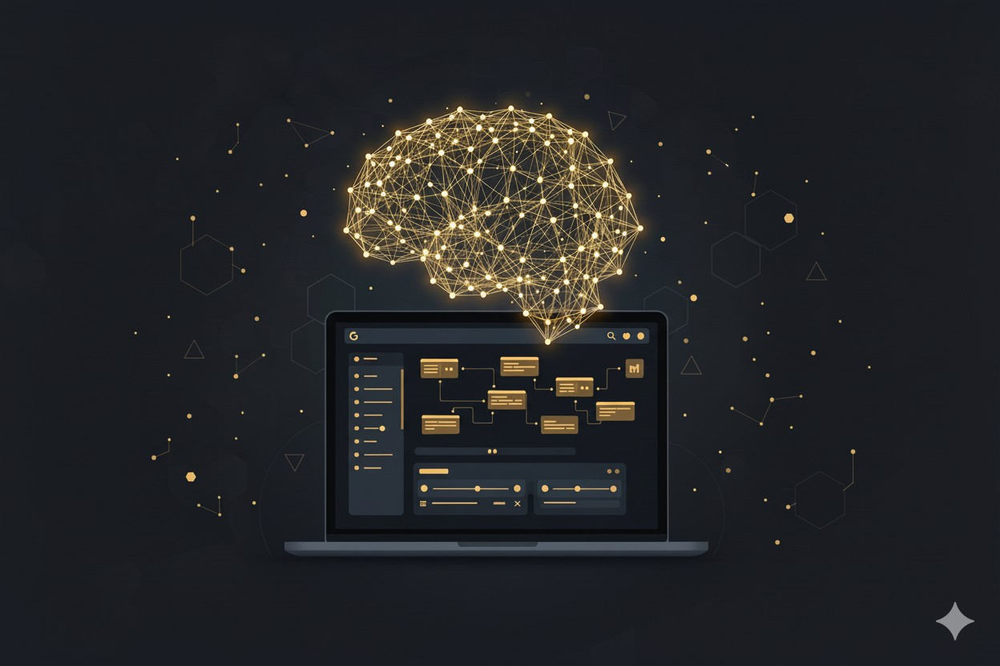
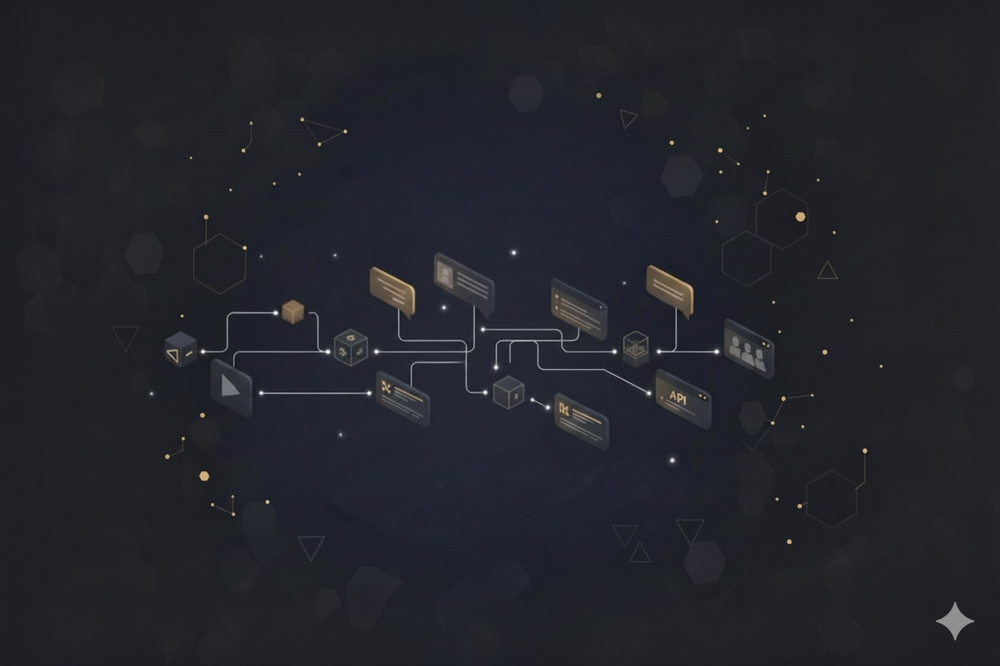
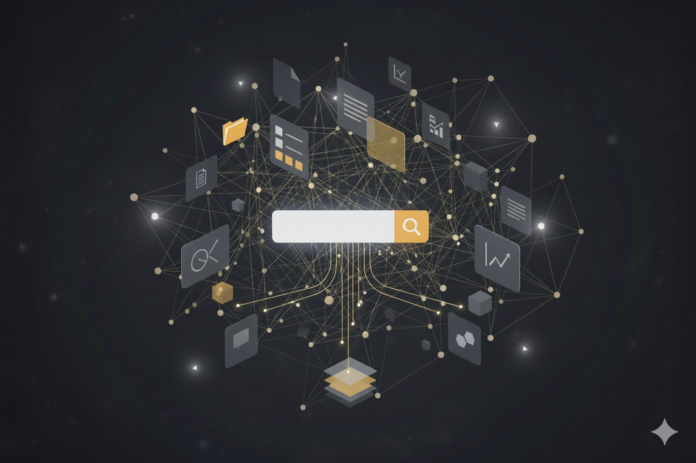
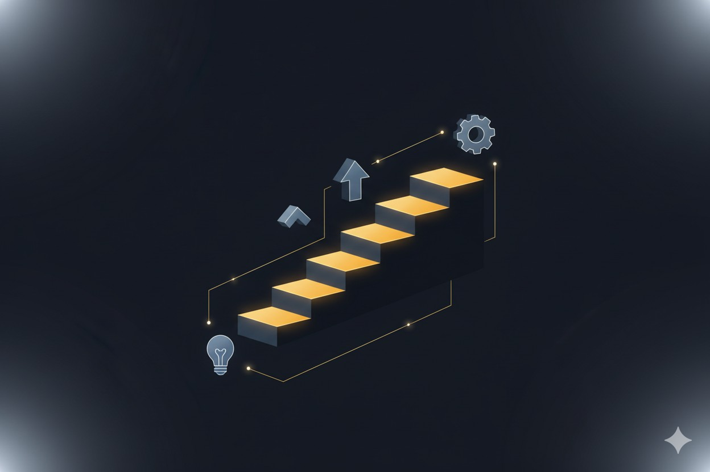

## Vertex AI

Mitä jos voisit valjastaa **Googlen tehokkaimmat tekoälytyökalut** suoraan oman yrityksesi käyttöön? **Google Vertex AI** -ekosysteemi tuo suurten kielimallien (LLM) voiman helposti käyttöön pilvipalveluna. Se on yhtenäinen alusta, joka kokoaa kaikki tekoälyratkaisujen hyödyntämiseen tarvittavat komponentit yhden katon alle.

Tämä tarkoittaa sitä, että monimutkaisen teknologian käyttöönotto on huomattavasti aiempaa helpompaa. Teidän ei enää tarvitse koostaa palveluita erillisistä paloista, vaan saatte valmiin ja toimivan ekosysteemin, joka kommunikoi sujuvasti suomen kielellä.

Käydään seuraavaksi läpi, että mistä osista tämä "tekoälyn työkalupakki" koostuu ja mitä hyötyä niistä on liiketoiminnalle.

### Gemini

**Gemini** on **Vertex AI** -alustan "aivot". Se on **Googlen** uusin ja tehokkain tekoälymalli, joka pystyy ymmärtämään ja käsittelemään tietoa monipuolisemmin kuin koskaan ennen.

Mitä tämä tarkoittaa käytännössä?

* **Ymmärtää muutakin kuin tekstiä**: **Gemini** on "**multimodaalinen**", mikä tarkoittaa, että se pystyy yhdistämään tietoa paitsi tekstistä, myös kuvista, äänestä tai vaikkapa koodista.
* **Tuottaa laadukasta sisältöä:** Se osaa laatia yhteenvetoja, vastata monimutkaisiin kysymyksiin ja tuottaa luonnollista, sujuvaa kieltä.
* **On skaalautuva**: Malliperheestä löytyy eri kokoisia versioita (kuten Ultra, Pro ja Flash). Tämä on kustannustehokasta: voimme valita juuri oikean tehoisen ja hintaisen mallin kuhunkin tehtävään, joten et maksa turhasta.

**Gemini** on moottori, joka pyörittää **Vertex AI:n** älykkäitä toimintoja.

### Vertex AI Agent Builder

**Vertex AI Agent Builder** on työkalu, jolla luodaan käytännön tekoälyagentteja. Ajattele näitä väsymättöminä digitaalisina työntekijöinä, kuten älykkäinä chatbotteina tai sisäisinä assistentteina, jotka palvelevat asiakkaitasi tai auttavat henkilöstöäsi.

Tämän työkalun avulla voimme rakentaa yrityksellesi agentin, joka:

* **Keskustelee luonnollisesti** ja ymmärtää asiakkaidesi tai työntekijöidesi tarpeet.
* **Suorittaa tehtäviä**: Esimerkiksi varaa aikoja, tarkistaa tilauksia tai kirjaa tukipyyntöjä.
* **Yhdistyy olemassa oleviin järjestelmiin:** **Agent Builderissa** on yli 100 valmista liitintä (konnektoria) esimerkiksi Salesforceen, Slackiin, Jiraan tai Confluenceen. Tämä tarkoittaa, että tekoäly voi hakea tietoa ja toimia suoraan niissä työkaluissa, joita jo käytätte.

Sinun ei tarvitse huolehtia palvelimista tai ylläpidosta. Alusta hoitaa sen ja me voimme keskittyä luomaan tehokkaan agentin liiketoimintasi tueksi.

### Vertex AI Search

Tämä on yksi **Vertex AI:n** tehokkaimmista ja helpoimmin lähestyttävistä osista. **Vertex AI Search** antaa sinulle mahdollisuuden tuoda Googlen tasoisen haun ja tekoälyn suoraan **yrityksesi omaan dataan.**

Käytännössä tämä tarkoittaa, että asiakkaasi tai työntekijäsi voivat esittää kysymyksiä luonnollisella kielellä (kuten "Mitkä ovat tuotteen X takuuehdot?" tai "Missä on uusin markkinointisuunnitelma?")  ja tekoäly löytää vastauksen suoraan yrityksesi dokumenteista, ohjeista tai tietokannoista.

Se ei vain anna sinulle listaa linkeistä, vaan **Vertex AI Search** pystyy laatimaan suoran, tiivistetyn vastauksen ja näyttämään, mistä **lähteistä tieto on peräisin.**

Tämä on tekoälyn hyödyntämistä turvallisesti: Se ei keksi vastauksia omasta päästään, vaan perustaa ne aina yrityksesi omaan, hallinnoituun tietoon. Parasta on, että liikkeelle päästään nopeasti. Voimme toteuttaa tehokkaan haun tai chatbot-prototyypin verkkosivuillesi lisäämällä sinne valmiin linkin.

### Vertex AI Studio

**Vertex AI Studio** on **Google Cloud** -alustaan kuuluva tehokas, selainpohjainen käyttöliittymä, joka on suunniteltu erityisesti generatiivisen tekoälyn (GenAI) mallien hyödyntämiseen ja **sovellusten rakentamiseen.**

Yrityksille tämä tarkoittaa nopeutta ja ketteryyttä. Meidän ei tarvitse aloittaa joka kerta raskaasta kuukausien koodausprojektista. Voimme **Vertex AI Studion** avulla:

* **Suunnitella kehotteita (Prompt design)**: Testata helposti, millaisilla kysymyksillä ja ohjeilla tekoälyltä saadaan parhaat ja hyödyllisimmät vastaukset.
* **Hienosäätää (fine-tuning):** Opettaa tekoälyä ymmärtämään teidän alanne erityissanastoa tai sisäisiä prosesseja yrityksen omalla datalla.
* **Kokeilla valmismalleja:** Hyödyntää laajaa **Model Garden** -kirjastoa, josta löytyy satoja valmiita malleja eri tarpeisiin, mukaan lukien suosittuja avoimen lähdekoodin malleja.

**Vertex AI Studio** on yritystason työkalu. Se on suunniteltu tuotantokäyttöön ja integroituu muihin pilvipalveluihin (kuten tietokantoihin ja MLOps-työkaluihin). Studion avulla voimme löytää oikean tekoälymallin teidän käyttöönne, **testata** sitä, **räätälöidä** sen juuri teidän datallanne ja lopulta tuoda sen mukaan **omiin sovelluksiinne**.

### Integraatiot

**Vertex AI:n** suurin vahvuus piilee siinä, ettei se ole erillinen saareke. Se on suunniteltu toimimaan saumattomasti yhteen niiden työkalujen kanssa, joita todennäköisesti jo käytät.

* **[Google Workspace](https://www.tdp.fi/ohjelmistot/google-workspace/)** (Gmail, Drive, Docs): Tekoäly voidaan kytkeä auttamaan suoraan sähköpostien laatimisessa tai hakemaan tietoa Drivesta (aina käyttäjän luvalla).
* **BigQuery** (Tietovarasto): Jos yrityksesi kerää dataa tietovarastoon, tekoäly voi analysoida sitä suoraan siellä. Voitte esimerkiksi pyytää tekoälyä analysoimaan vapaamuotoista asiakaspalautetta suoraan datakyselyn yhteydessä.
* **Muut järjestelmät** (esim. Salesforce, SAP, HubSpot): Valmiiden laajennusten ja konnektoreiden ansiosta tekoäly saadaan keskustelemaan myös yrityksesi muiden tärkeiden järjestelmien, kuten asiakkuudenhallinnan (CRM), kanssa.

Yhteenvetona voidaan todeta, että **Vertex AI** -ekosysteemi on joustava ja modulaarinen kokonaisuus. Se tarjoaa yrityksille tehokkaat, mutta saavutettavat työkalut tekoälyn hyödyntämiseen.

### Konkreettisia mahdollisuuksia arjen tehostamiseksi

Generatiivinen tekoäly saattaa kuulostaa kaukaiselta tai monimutkaiselta, mutta sen tuomat hyödyt ovat hyvin käytännönläheisiä. Kyse ei ole tieteisfiktiosta, vaan uusista työkaluista, jotka säästävät aikaa, vähentävät manuaalista työtä ja parantavat asiakaspalvelua.

Olemme tunnistaneet asiakkaidemme arjesta useita tilanteita, joissa **Google Vertex AI** -alustan työkalut voivat tuoda välitöntä hyötyä. Tässä muutamia esimerkkejä:

#### 1. Ajansäästö

**Pitkien dokumenttien automaattinen tiivistäminen:** Kuinka monta kertaa pöydälläsi on ollut satojen sivujen laajuinen tarjouspyyntö, projektisuunnitelma tai sopimusluonnos? Niiden läpikäynti ja olennaisen hahmottaminen vie valtavasti asiantuntijoiden ja johdon aikaa.

Voimme rakentaa **Vertex AI:n** avulla työkalun, joka "lukee" nämä pitkätkin asiakirjat puolestasi ja laatii niistä **tiiviin yhteenvedon** haluamallasi kielellä, vaikkapa suomeksi. Tämä tuo huomattavaa ajansäästöä valmistelutyössä. Voit tehdä parempia päätöksiä nopeammin, kun hahmotat keskeiset kohdat, riskit ja mahdollisuudet minuuteissa, et tunneissa.

#### 2. Tiedonhaku

**Älykäs haku projekteista ja kokousmuistioista**: Tieto on usein hajallaan sähköposteissa, projektikansioissa ja vanhoissa muistioissa. Tiedon etsimiseen kuluu turhaa aikaa, ja välillä tärkeät päätökset unohtuvat. Entä jos voisit vain kysyä luonnollisella kielellä: "Mitkä olivat keskeiset päätökset viime kokouksen pöytäkirjassa?" tai "Mitä asiakkaan X kanssa sovittiin toimitusajoista?"

Voimme toteuttaa **Vertex AI Search** -toiminnon ja tekoälyagentin avulla yrityksellenne sisäisen haun, joka **etsii vastaukset suoraan dokumenteistanne**. Samalla logiikalla voidaan automatisoida kokousmuistioiden kirjoittaminen: tekoäly kuuntelee tallenteen ja kirjaa ylös tiivistelmän, sekä sovitut tehtävät.

Tämän ansiosta tiedon etsimiseen hukattu aika vähenee. Projektit pysyvät paremmin raiteillaan, kun kaikki löytävät tarvitsemansa tiedon välittömästi.

#### 3. Asiakaspalvelu

**Asiakasviestinnän älykkäät chatbotit:** Asiakkaat odottavat vastauksia heti, myös iltaisin ja viikonloppuisin. Samaan aikaan myynti ja asiakaspalvelu vastailevat jatkuvasti samoihin peruskysymyksiin.

Verkkosivuillenne integroitava älykäs chatbot voi mullistaa asiakaspalvelun. Se ymmärtää suomea ja osaa hakea vastaukset yleisimpiin kysymyksiin suoraan esimerkiksi tuotetiedoistanne tai UKK-osiosta, palvellen asiakasta 24/7.

**Vertex AI Agent Builder** -työkalulla voimme **räätälöidä chatbotin toimimaan teidän tarpeidenne mukaan**: se voi kerätä liidejä CRM-järjestelmään, varata aikoja tai yhdistää monimutkaisemmat keskustelut suoraan oikealle asiantuntijalle.

Asiakastyytyväisyys paranee välittömän palvelun ansiosta. Samalla vapautatte myynnin ja tuen aikaa rutiinitehtävistä arvokkaampaan työhön, kuten vaativampien asiakastilanteiden hoitoon ja kauppojen tekemiseen.

#### 4. Raportointi

**Raporttien ja työmaapäiväkirjojen automatisointi:** Monilla aloilla (kuten rakentaminen, huolto, logistiikka) kentällä tehtävä työ on nopeaa, mutta raportointi on hidasta ja manuaalista. Työmaapäiväkirjat tai huoltoraportit kirjoitetaan usein kiireessä päivän päätteeksi ja tietoja jää kirjaamatta.

Generatiivinen tekoäly voi **hoitaa kirjaamisen**. Työntekijä tai työnjohtaja voi yksinkertaisesti sanella päivän tapahtumat, havainnot ja poikkeamat puhelimeensa. Tekoäly litteroi puheen, muotoilee siitä siistin ja johdonmukaisen päiväraportin ja jopa korostaa tärkeimmät huomiot, kuten viivästykset tai turvallisuusasiat.

Manuaalinen kirjaustyö vähenee dramaattisesti. Tiedon laatu paranee, kun asiat kirjataan heti tuoreeltaan. Samalla johto saa ajantasaista tietoa kentältä, mikä vähentää riskejä ja **auttaa reagoimaan ongelmiin nopeammin.**

#### 5. Vaatimustenmukaisuus

**Tekoäly apuna ohjeiden ja määräysten tulkinnassa:** Erityisesti säännellyillä aloilla lakien, standardien ja sisäisten toimintaohjeiden määrä on valtava. Oikean tiedon löytäminen monimutkaisista ohjeistoista on työlästä ja virhealtista.

Voimme luoda organisaatiollenne oman tekoälyasiantuntijan, joka on koulutettu **vain teidän omilla materiaaleillanne.** Henkilöstö voi kysyä siltä suoraan: "Mitä uusi jätehuoltomääräys sanoo rakennustyömaan jätteiden käsittelystä?" tai "Mikä on yrityksemme käytäntö etätyöpäivien kirjaamiseen?"

Tekoälyagentti etsii vastauksen oikeasta pykälästä tai ohjeesta ja vastaa käyttäjälle **selkeällä suomen kielellä**, viitaten aina alkuperäiseen lähteeseen. Tiedon löytäminen nopeutuu ja vaatimustenmukaisuus (compliance) paranee. Kun oikea ja ajantasainen tieto on kaikkien saatavilla helposti kysymällä, riski virheisiin ja kalliisiin laiminlyönteihin pienenee.

#### Mistä kannattaisi aloittaa?

Nämä esimerkit ovat vain pintaraapaisu. Tärkeintä ei ole yrittää tehdä kaikkea kerralla, vaan lähteä liikkeelle juuri teidän liiketoimintanne kannalta olennaisimmista haasteista.

Me voimme kumppanina auttaa tunnistamaan parhaat ideat ja toteuttamaan ensimmäisen kokeilun nopeasti ja ketterästi. Usein pienestäkin pilottiprojektista voi kasvaa suuri kehitysloikka, kun tekoäly integroidaan fiksusti osaksi arjen prosesseja.

### Mitä hyötyä Vertex AI:sta on PK-yritykselle?

#### Helppo käyttöönotto ilman raskaita palvelinprojekteja

Monia yrittäjiä mietityttää, että tarkoittaako tekoälyn käyttöönotto automaattisesti valtavaa, kuukausien IT-projektia ja kalliita laitehankintoja. **Google Vertex AI:n** kohdalla vastaus on selkeä: **ei tarkoita.**

Koska kyseessä on **Googlen pilvialusta**, teidän ei tarvitse investoida omiin palvelimiin tai niiden ylläpitoon. Jos yrityksellänne on jo käytössä [Google Workspace](https://www.tdp.fi/ohjelmistot/google-workspace/) tai muita **Google Cloud** -palveluita, kuten **BigQuery**, **Vertex AI** istuu saumattomasti ja luontevasti samaan, tuttuun ympäristöön.

#### Nopeita tuloksia ja pienempi riski

Perinteisesti uudet tietojärjestelmähankkeet ovat voineet tarkoittaa kuukausien tai jopa vuosien projekteja. Generatiivisen tekoälyn kanssa maailma on toinen.

Voimme pilotoida uutta ideaa viikoissa, emmekä kuukausissa. Esimerkiksi yksinkertaisen asiakaspalveluchatbotin prototyyppi voidaan saada testikäyttöön **jopa muutamassa päivässä** **Vertex AI:n** valmiiden työkalujen ansiosta.

PK-yritykselle tämä tarkoittaa merkittävästi pienempää riskiä. Voimme kokeilla ketterästi useita ideoita pienellä budjetilla ja nähdä heti, mikä tuottaa tulosta. Jos jokin kokeilu ei toimikaan toivotusti, siitä opitaan ja siirrytään seuraavaan ilman suuria uponneita kustannuksia.

Ja kun toimiva ratkaisu löytyy, sen skaalaaminen tuotantokäyttöön tuhansillekin käyttäjille onnistuu **Google Cloudin** ansiosta vaivattomasti. **Kapasiteetti kasvaa automaattisesti tarpeen mukaan.**

#### Hallittu aloitus

Generatiivinen tekoäly on uusi asia lähes kaikille. Teidän ei tarvitse palkata omaa kallista data-asiantuntijoiden tiimiä päästäksenne alkuun. Me toimimme kumppaninanne ja hoidamme teknologian puolestanne. Paketteihimme kuuluu kaikki tarvittava:

* **Kartoitus:** Autamme tunnistamaan juuri teidän liiketoiminnallenne sopivimmat ja tuottavimmat käyttökohteet.
* **Toteutus:** Suunnittelemme ja rakennamme ratkaisun **Vertex AI** -alustalle ja integroimme sen nykyisiin järjestelmiinne.
* **Ylläpito ja turvallisuus:** Huolehdimme, että ratkaisu toimii luotettavasti, pysyy tietoturvallisena ja päivittyy aina uusimpiin, tehokkaampiin malleihin (kuten uusimpaan **Gemini**-versioon).
* **Koulutus:** Varmistamme, että henkilöstönne osaa ja haluaa käyttää uusia työkaluja, jotta niistä tulee luonteva osa arkea.

Te voitte keskittyä omaan ydinliiketoimintaanne samalla kun me varmistamme, että saatte tekoälystä todellisen hyödyn irti. **Helposti, turvallisesti ja ilman teknistä päänsärkyä.**

### Tekoälyn käyttöönottoon liittyvät riskit

Uusien teknologioiden käyttöönottoon liittyy aina kysymyksiä. Vaikka generatiivinen tekoäly tarjoaa valtavia mahdollisuuksia, on tärkeää tunnistaa ja hallita siihen liittyvät riskit fiksusti.

Yritysten ei tarvitse kohdata näitä kysymyksiä yksin. Käydään läpi yleisimmät huolenaiheet ja miten me kumppanina varmistamme, että tekoälyn käyttö on turvallista ja tuottavaa.

#### 1. Tietosuoja ja GDPR

Tämä on yleensä ensimmäinen ja tärkein kysymys: "Jos käytämme tekoälyä, päätyvätkö meidän luottamukselliset asiakastiedot tai liikesalaisuudet julkiseen internetiin?"

Vastaus **Google Vertex AI:n** kohdalla on selkeä: **Eivät päädy.**

Toisin kuin julkisia tekoälypalveluita käytettäessä, **Vertex AI:lla** kaikki data pysyy **täysin teidän omassa hallinnassanne**, yrityksen omassa, suljetussa Google Cloud -ympäristössä.

* **Google ei käytä dataasi malliensa kouluttamiseen:** Tietoja, joita syötätte Vertex AI -ratkaisuun (kuten asiakaslistoja tai sisäisiä suunnitelmia), ei käytetä Googlen julkisten mallien opettamiseen. Data on ja pysyy teidän hallussanne.
* **Korkeat standardit:** Google Cloud -alusta itsessään täyttää alan tiukimmat tietoturvastandardit ja sertifioinnit (kuten ISO/IEC 27001).
* **Me varmistamme asetukset:** Meidän tehtävämme kumppanina on huolehtia, että ratkaisu on konfiguroitu oikein. Varmistamme, että data siirtyy aina salattuna ja että pääsyoikeudet ovat kunnossa.
* **Sisäänrakennettu turvallisuus:** Uusimmissa Gemini-malleissa on myös sisäänrakennetut suodattimet, jotka estävät sopimattoman sisällön tuottamisen ja pitävät tekoälyn "ruodussa" yrityksenne arvojen mukaisesti.

Voitte siis käsitellä materiaalejanne **turvallisin mielin.**

#### 2. Kustannusten hallinta

Pilvipalvelut, mukaan lukien **Vertex AI**, noudattavat "maksa käytön mukaan" -mallia. Tämä madaltaa kokeilemisen kynnystä: voitte aloittaa pienen kokeilun, joka maksaa vain muutamia euroja kuukaudessa.

Riski piilee siinä, jos käyttöä ei seurata ja se kasvaa hallitsemattomasti. Tekoälyn kulut perustuvat usein datan käsittelymäärään (esim. kuinka paljon tekstiä malli lukee ja tuottaa).

Me emme vain asenna työkalua, vaan autamme teitä aktiivisesti budjetoinnissa ja seurannassa. Näin pidämme kulut hallinnassa:

* **Asetamme hälytykset:** Hyödynnämme Google Cloudin kustannushälytyksiä, jotka ilmoittavat heti, jos käyttö on ylittämässä sovitun budjetin.
* **Optimoimme käyttöä:** Varmistamme, että tekoälymalleja käytetään tehokkaasti ja vain tarpeellisiin operaatioihin.
* **Aloitamme pienesti:** Suosittelemme aina aloittamaan pienellä, rajatulla kokeilulla. Näin näemme todelliset kulut ja voimme kasvattaa käyttöä hallitusti, kun hyödyt on todennettu.

Näin tekoälyn kulut pysyvät aina ennakoitavina ja suhteessa sen tuottamaan hyötyyn.

#### 3. Muutosvastarinta

Uusi työkalu on hyödyllinen vasta, kun ihmiset käyttävät sitä. On luonnollista, että tekoäly herättää henkilöstössä kysymyksiä tai jopa epävarmuutta: "Korvaako tämä minun työni?" tai "Voinko luottaa tähän?"

Tärkein viestimme on aina tämä: Tekoäly on työkalu, joka auttaa ihmisiä tekemään työnsä paremmin, ei korvaa heitä. Tekoäly on loistava apuri rutiineissa, mutta **asiantuntija tekee aina lopullisen päätöksen** ja varmistaa laadun.

**Me autamme teitä muutoksessa:**

* **Otamme henkilöstön mukaan:** Emme vain asenna ohjelmistoa, vaan otamme tulevat käyttäjät mukaan suunnitteluun alusta alkaen.
* **Koulutamme käytäntöön:** Tarjoamme käytännön koulutusta juuri heidän rooliinsa: miten myyjä hyödyntää uutta chattia tai miten projektitiimi käyttää uutta hakua.
* **Laadimme pelisäännöt:** Autamme kokoamaan selvät ohjeet tekoälyn käyttöön. Näin kaikki tietävät, miten toimia ja miten esimerkiksi mahdolliset virheet tunnistetaan ja korjataan.

**Vertex AI** tarjoaa itsessään yritystason tietoturvan ja tehokkaat hallintatyökalut. Meidän tehtävämme on varmistaa, että teknologia, prosessit ja ihmiset pelaavat yhteen. Näin varmistamme, että voitte hyödyntää tekoälyä vastuullisesti, kustannustehokkaasti ja tavalla, joka **aidosti edistää liiketoimintaanne.**

### Miten päästä alkuun?

Generatiivisen tekoälyn kanssa liikkeelle pääsemisen ei tarvitse olla valtava, kuukausien IT-projekti. Usein suurin kynnys on juuri aloittaminen.

Me suosittelemme selkeää kahden vaiheen mallia, joka **minimoi riskit ja näyttää konkreettiset hyödyt nopeasti.**

#### Vaihe 1: Nopea kokeilu

Ensimmäinen askel on poistaa arvailu. Sen sijaan, että suunnittelisimme laajaa järjestelmää, toteutamme pienen, tarkan pilotin, joka saadaan valmiiksi jopa muutamassa viikossa.

Keskitymme yhteen, selkeään käyttötapaukseen. Esimerkkejä tällaisesta ovat:

* **Chatbot-kokeilu:** Rakennetaan yksinkertainen suomenkielinen chatbot, joka osaa vastata yleisimpiin kysymyksiin yhdestä tietystä palvelustanne tai tuotteestanne.
* **Sisäinen haku -testi:** Kytketään **Vertex AI Search** -haku yrityksenne intranetiin tai tukitietokantaan. Testataan käytännössä, miten paljon nopeammin henkilöstö löytää oikeat ohjeet.
* **Dokumenttianalyysi:** Otetaan yksi pitkä asiakirja (kuten tarjous tai projektisuunnitelma) ja ajetaan se **Gemini**-mallin läpi. Katsotaan, millaisen yhteenvedon ja löydökset tekoäly tuottaa.

#### Vaihe 2: Laajennus ja integrointi

Kun kokeilu on osoittanut arvonsa, on aika siirtää onnistuminen osaksi pysyviä prosesseja. Tämä ei tarkoita, että kaikki pitäisi rakentaa alusta uudelleen. **Google Vertex AI** -alustan  etuihin kuuluu sen saumaton skaalautuvuus.

Tässä vaiheessa ratkaisua laajennetaan hallitusti:

* **Chatbot** voidaan integroida suoraan yrityksenne asiakaspalvelujärjestelmään. Jos botti ei osaakaan vastata, se siirtää keskustelun sulavasti oikealle ihmisasiantuntijalle. Samalla sen tietopohjaa laajennetaan kattamaan kaikki tuotealueet.
* **Dokumenttien yhteenveto** voidaan automatisoida niin, että tekoäly tuottaa raportin automaattisesti aina tietyn prosessin päätteeksi.

Me hoidamme teknisen toteutuksen "avaimet käteen" -periaatteella:

* **Räätälöinti:** Teemme ratkaisusta tuotantovalmiin. Tarvittaessa "hienosäädämme" (fine-tuning) tekoälymallia yrityksenne omalla datalla, jotta sen tarkkuus ja tyyli ovat huippuluokkaa.
* **Integraatiot:** Kytkemme tekoälyn keskustelemaan yrityksenne muiden järjestelmien, kuten tietokantojen tai käyttäjähallinnan, kanssa.
* **Ylläpito ja skaalaus:** Googlen teknologia (kuten **Agent Engine**) huolehtii taustalla palvelun toimivuudesta, tietoturvasta ja skaalautumisesta. Voitte luottaa siihen, että ratkaisu palvelee luotettavasti, vaikka käyttäjämäärät kasvaisivat.

Samalla kun hoidamme tekniikan, koulutamme henkilöstönne käyttämään uusia työkaluja tehokkaasti. Kuljemme rinnallanne ja varmistamme, että tekoälystä tulee luonteva osa arkea ja se tuottaa arvoa vielä vuosienkin päästä.

### Yhteenveto

On selvää, että tekoäly on saapunut jäädäkseen. Ja mikä parasta, se on nyt aidosti tarjolla myös pk -yrityksille.  Vielä muutama vuosi sitten ammattitasoiset tekoälyratkaisut näyttivät vain jättiyritysten kalliilta kokeiluilta, mutta **Google Vertex AI:n** kaltaiset alustat ovat muuttaneet pelin. Niiden ansiosta on mahdollista saada generatiivisen tekoälyn todelliset hyödyt osaksi kaikkien yritysten arkea.

Kuten olemme tässä artikkelissa läpikäyneet, niin työkalut kuten **Vertex AI Studio, Vertex AI Agent Builder ja Vertex AI Search** eivät ole monimutkaista teknologiaa teknologian vuoksi. Ne tarjoavat käytännön ratkaisuja, joilla voidaan tehostaa työtä, parantaa asiakaspalvelua ja löytää uusia oivalluksia omasta datasta.

Nyt on oikea hetki toimia. Tekoäly on kehittynyt pisteeseen, jossa sen hyödyntäminen on paitsi teknisesti helppoa, myös taloudellisesti järkevää lähes kaikenkokoisille yrityksille. Pienikin, fiksusti kohdennettu askel tekoälyn suuntaan voi tuoda merkittävää kilpailuetua ja vapauttaa henkilöstönne aikaa rutiineista arvokkaampaan työhön.

Haluatko selvittää, mitä tekoäly voisi tehdä juuri teidän liiketoiminnassanne?

[Ota meihin yhteyttä.](https://www.tdp.fi/GoogleVertexAI-ekosysteemi/#contact-form) Lupauksemme on, ettemme yritä myydä sinulle monimutkaista järjestelmää, vaan käydään yhdessä läpi teidän arjen haasteenne. Autamme tunnistamaan sen ensimmäisen pienen kokeilun, jolla saadaan aikaan suurin hyöty.

Olemme täällä auttaaksemme teitä ottamaan ensimmäisen askeleen ja **varmistaaksemme, että siitä kasvaa menestystarina!**

### Usein kysytyt kysymykset (UKK)

Tekoäly herättää paljon kysymyksiä. Kokosimme tähän yleisimpiä pohdintoja ja selkeät vastaukset niihin.

#### 1. Miten Vertex AI:n hinnoittelu toimii? Onko se kallis PK-yritykselle?

Tämä on yleensä ensimmäinen kysymys, ja vastaus on PK-yrittäjälle hyvä: Vertex AI:ssa ei ole kalliita, kiinteitä lisenssimaksuja.

Hinnoittelu perustuu täysin todelliseen käyttöön (ns. "pay-as-you-go" -malli). Maksat vain siitä, mitä käytät.

* **Matalat aloituskulut**: Pienimuotoinen kokeilu tai vähän käytetty chatbot voi maksaa vain muutamia kymmeniä euroja kuukaudessa.
* **Riskitön kokeilu:** Google tarjoaa usein uusille asiakkaille 300 dollarin arvosta yleiskäyttöisiä krediittejä ja tämän lisäksi jopa 1000 dollarin krediitit Vertex AI Search -hakupalvelun kokeiluun. Aloittaminen on siis käytännössä ilmaista.
* **Ei yllätyslaskuja:** Kulut skaalautuvat käytön mukaan. Tämä on reilua: jos käyttö kasvaa, tekoäly todennäköisesti myös tuottaa yrityksellesi enemmän arvoa. Meidän tehtävämme kumppanina on auttaa teitä budjetoinnissa ja asettaa Google Cloud -ympäristöön kustannushälytykset, jotta budjetti ei ylity yllättäen.

Tämä joustava malli sopii erinomaisesti myös PK-yritykselle, koska kynnys aloittamiseen on olematon.

#### 2. Tarvitsemmeko meillä olevaa "big dataa" tai omia aineistoja, jotta voimme hyödyntää tätä?

Ei välttämättä. Googlen tekoälymallit (kuten Gemini) on koulutettu valtavalla määrällä julkista tietoa. Ne osaavat siis jo valmiiksi tiivistää tekstejä, kääntää kieliä tai vastata yleistietoisiin kysymyksiin ilman, että niille tarvitsee opettaa mitään uutta.

Todellinen liiketoimintahyöty saadaan kuitenkin yleensä silloin, kun tekoäly valjastetaan käyttämään teidän omaa dataanne. Jos haluat tekoälyn vastaavan kysymyksiin yrityksesi sisäisistä ohjeista, tuotetiedoista tai asiakasprojekteista ne täytyy tuoda mallien saataville niiden hyvin ymmärtämässä muodossa. Me voimme auttaa tässä. 

#### 3. Ymmärtääkö Vertex AI ja Gemini suomen kieltä?

Kyllä, erinomaisesti. Tämä on yksi suurimmista harppauksista aiempaan. Uusimmat Gemini-mallit on koulutettu laajasti myös suomenkielisellä aineistolla.

**Ne ymmärtävät suomeksi esitettyjä kysymyksiä ja tuottavat laadukasta, luontevaa ja kieliopillisesti oikeaa suomea vastauksena.**

Voit siis huoletta rakentaa chatbotin palvelemaan suomalaisia asiakkaitasi tai antaa tekoälyn tehdä yhteenvetoja suomenkielisistä sopimuksista. Jos yrityksellänne on paljon omaa erikoissanastoa, voimme auttaa mallia oppimaan myös ne.

#### 4. Miten tietosuoja ja GDPR on hoidettu? Uskallammeko laittaa sinne yrityksemme dataa?

Tämä on tärkein kysymys, ja vastaus on selkeä: Vertex AI on suunniteltu yrityskäyttöön, ja sen tietoturva on huippuluokkaa. Suurin ero verrattuna julkisiin tekoälypalveluihin (kuten ilmainen ChatGPT) on tämä:

**Google ei käytä teidän Vertex AI:hin syöttämäänne dataa omien julkisten malliensa kouluttamiseen**.

Kun käytät Vertex AI:ta, kaikki data pysyy teidän omassa, suljetussa Google Cloud -ympäristössänne.

* **Data pysyy teidän hallussanne**: Tietojanne (kuten asiakaslistoja tai sisäisiä muistioita) ei lähetetä mihinkään julkiseen tietokantaan.
* **Täyttää standardit:** Palvelu täyttää tiukimmat kansainväliset tietoturvastandardit (kuten ISO 27001) ja noudattaa GDPR-asetusta.
* **Me varmistamme loput**: Kumppanina huolehdimme, että käyttöoikeudet on määritelty oikein ja että datan käsittely noudattaa parhaita käytäntöjä.

Voitte siis hyödyntää tekoälyä omalla datalla ilman pelkoa tietovuodoista.

#### 5. Kuinka nopeasti käyttöönotosta saa konkreettisia tuloksia?

Yllättävän nopeasti. Emme puhu kuukausien tai vuosien IT-projekteista. Generatiivisen tekoälyn pilotoinnissa puhutaan viikoista.

Koska Vertex AI tarjoaa niin paljon valmiita työkaluja, voimme toteuttaa pienen, rajatun kokeiluprojektin ideasta ensimmäiseen testaukseen usein noin kahdessa viikossa.

Näette siis toimivan ratkaisun ja sen tuomat hyödyt välittömästi. Jos tavoitteena on esimerkiksi 30 %:n säästö jossain tietyssä rutiinitehtävässä, tämän vaikutuksen mittaaminen voi viedä muutaman kuukauden, mutta ensimmäiset käytännön tulokset näkyvät heti.

#### 6. Tarvitsemmeko omia ohjelmoijia tai datatieteilijöitä tämän käyttöön?

Ette tarvitse. Tämä on juuri se, missä me kumppanina autamme.

Teidän ei tarvitse palkata omia koodareita tai data-analyytikoita hyödyntääksenne tekoälyä.

* **Me hoidamme tekniikan:** Meidän tiimimme huolehtii tarvittavista teknisistä määrityksistä ja integraatioista (eli kytkemme tekoälyn keskustelemaan muiden järjestelmienne kanssa).
* **Helppo kokeilla**: Vertex AI Studio -työkalussa on graafinen käyttöliittymä, jossa tekoälyä voi kokeilla ja ohjeistaa ilman riviäkään koodia.
* **Loppukäyttäjälle helppo**: Yrityksenne työntekijä (esim. asiakaspalvelija tai projektipäällikkö) ei tarvitse mitään teknistä osaamista. Hänelle työkalu näkyy yksinkertaisena keskusteluikkunana tai hakukenttänä.

Me tuomme teknisen asiantuntemuksen, jotta te voitte keskittyä täysin liiketoimintahyötyihin.

#### 7. Miten pääsemme alkuun ja miten te autatte meitä?

Aloittaminen on tehty todella helpoksi.

* **Ota meihin yhteyttä.** Riittää, että olet utelias.
* **Käydään lyhyt kartoitus**: Pidämme palaverin, jossa emme puhu tekniikasta, vaan teidän liiketoiminnastanne. Mitkä ovat teidän arjen haasteet tai suurimmat aikasyöpöt?
* **Ehdotamme pientä pilottia:** Tämän keskustelun pohjalta ehdotamme yhtä, pientä kokeilua, jolla saadaan suurin ja nopein hyöty (esim. aiemmin mainittu chatbot-kokeilu tai sisäinen haku).
* **Me toteutamme:** Hoidamme "avaimet käteen" -periaatteella projektin: perustamme ympäristön, toteutamme teknisen ratkaisun ja tuemme teitä testauksessa.

Meidän roolimme on olla teidän oppaanne ja toteuttajakumppaninne. Varmistamme, että pääsette turvallisesti ja tehokkaasti alkuun ja autamme teitä kasvattamaan onnistuneesta kokeilusta pysyvän, arvoa tuottavan ratkaisun.

#### 8. Miten Vertex AI eroaa julkisesta ChatGPT:stä?

Tämä on yleinen ja erittäin hyvä kysymys. Vaikka molemmat käyttävät generatiivista tekoälyä, ne palvelevat eri tarkoituksia. ChatGPT on julkinen "keskustelubotti", kun taas Vertex AI on alusta, jolla rakennetaan yrityksellesi oma, räätälöity tekoälyratkaisu.

Tässä kolme suurinta eroa PK-yritykselle:

* **Tietosuoja (Tärkein)**: Kuten kohdassa 4 mainittiin, Vertex AI:lla data pysyy teidän hallinnassanne. Kun syötät yritystietoja julkiseen ChatGPT:hen, lähetät ne ulkopuoliselle palvelimelle, jota et hallitse. Tätä riskiä ei Vertex AI:ssa ole.
* **Tarkkuus ja "Ankkurointi**": Vertex AI voidaan "ankkuroida" (engl. grounding) yrityksesi omiin aineistoihin. Se tarkoittaa, että tekoäly perustaa vastauksensa teidän ohjeisiinne tai tietokantoihinne, eikä arvaile vastauksia yleisen internet-tiedon perusteella. Tämä tekee vastauksista luotettavia ja tarkkoja.
* **Integrointi ja hallinta**: Vertex AI on suunniteltu integroitavaksi osaksi yrityksesi muita prosesseja ja järjestelmiä. Se on kokonainen alusta, jota voidaan hallita, valvoa ja skaalata yrityksen tarpeiden mukaan – toisin kuin julkinen kuluttajasovellus.\
  \
  *Artikkelin sisällön tuottamisessa on hyödynnetty tekoälyä kirjoittamisen tukena.*
