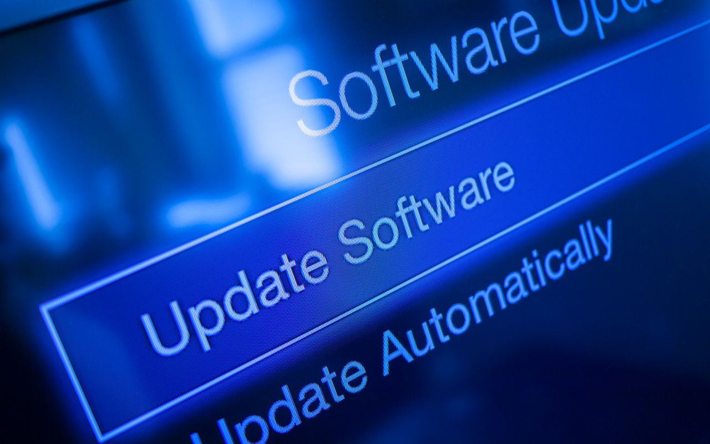

**Olet kiireinen tietotyöläinen, jolle deadline hengittää niskaan. Aamusi alkaa lupaavasti, mutta huomaat pian, että käyttämäsi korkeatasoinen ohjelmisto tökkii jälleen. Järjestelmäsi yhteensopivuusongelmat saavat sinut juoksemaan ympäriinsä etsimässä apua, ja projekti, joka piti hoitaa päivässä, paisuu viikon mittaiseksi painajaiseksi. Eikö kuulostakin liian tutulta?**

Vältä tällaiset ongelmat hankkimalla ISV-sertifioitu laite. Tässä artikkelissa kerromme, mikä ISV-sertifiointi on ja mitä lisäarvoa se tuo tietokoneen käyttäjälle. Lue eteenpäin ja tutustu sertifioinnin tarjoamiin hyötyihin. 

## Mikä on ISV-sertifiointi?

ISV (Independent Software Vendor) -sertifiointi tarkoittaa, että tietokone tai laite on testattu ja hyväksytty toimimaan saumattomasti tiettyjen ohjelmistojen kanssa. Sertifiointi suoritetaan puolueettoman tahon toimesta, joka varmistaa laitteen ja ohjelmiston yhteensopivuuden ja suorituskyvyn.

## Lisäarvo käyttäjälle: Hyvästit yhteensopivuusongelmille

ISV-sertifiointi tuo merkittävää lisäarvoa tietokoneen käyttäjälle. 

Se poistaa yhteensopivuusongelmat, jotka voivat aiheuttaa päänvaivaa ja viivästyksiä työssä. Tässä muutamia keskeisiä hyötyjä ISV-sertifioidun laitteen käyttäjälle:

**1. Saumaton yhteensopivuus**: Laitteen ja ohjelmiston yhteensopivuusongelmat ovat menneisyyttä, kun hankit ISV-sertifioidun laitteen. Näin voit keskittyä työhösi sen sijaan, että vietät aikaa ongelmien ratkaisuun.

**2. Parempi suorituskyky**: ISV-sertifioidut laitteet on optimoitu suorituskyvyltään, joten ne toimivat tehokkaasti yhdessä sertifioitujen ohjelmistojen kanssa. Näin saat työsi tehtyä nopeammin ja tehokkaammin.

**3. Vakaa ja luotettava toiminta**: ISV-sertifiointi takaa laitteen ja ohjelmiston välisen vakauden ja luotettavuuden. 

**4. Tuki ja päivitykset**: ISV-sertifioidut laitteet saavat säännöllisiä päivityksiä ja teknistä tukea valmistajilta sekä ohjelmistokehittäjiltä. Tämä tarkoittaa, että pysyt ajan tasalla uusimmista ominaisuuksista ja turvallisuusparannuksista, samalla kun saat asiantuntevaa apua mahdollisten ongelmien ratkaisemiseksi.

**5. Räätälöity ohjelmisto**: ISV-sertifioinnin ansiosta voit olla varma, että ohjelmistosi on räätälöity juuri sinun laitteellesi sopivaksi. Tämä mahdollistaa sen, että saat parhaan mahdollisen käyttökokemuksen ja suorituskyvyn.

**6. Investoinnin arvo**: Vaikka ISV-sertifioidut laitteet saattavat olla hieman kalliimpia alkuinvestoinnissa, niiden tarjoamat hyödyt, kuten parempi suorituskyky, vakaus ja tuki, tekevät niistä pitkällä aikavälillä kannattavan investoinnin.

## Ota seuraava askel kohti tehokasta ja vaivatonta työskentelyä

Ei ole väliä, oletko ohjelmistosuunnittelija, graafinen suunnittelija, insinööri tai talousasiantuntija, ISV-sertifiointi on avainasemassa saumattoman työskentelykokemuksen takaamiseksi. Se poistaa yhteensopivuusongelmat, parantaa suorituskykyä ja tekee työstäsi miellyttävämpää ja tehokkaampaa.