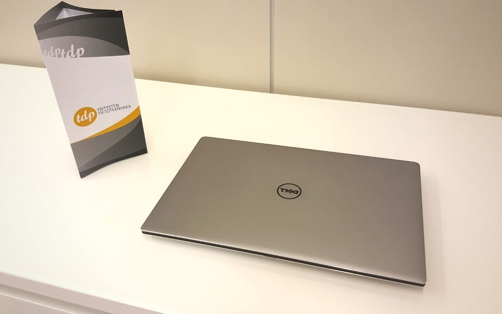

**Kokonaisuutena Tampereen Datapisteen toimintavuotta 2020 voidaan luonnehtia onnistuneeksi. Liikevaihto kasvoi aiempaan vuoteen nähden, yrityksen toimintaprosesseja ja asiakaspalvelua saatiin kehitettyä ja asiakaspalaute oli poikkeuksetta myönteistä.**

Koronan osalta vuosi oli TDP:llekin toki haastava. Asioita ja asiakkuuksia jouduttiin hoitamaan entistä enemmän etänä, lisäksi koronan vaatimiin muutoksiin kului resursseja. Toisaalta vuosi tarjosi luontevan syyn kehittää pidemmälle etätukipalvelujamme, jotka näemme keskeisenä, asiakkaillemme arvoa tuovana osa-alueena.

Loppuvuodesta teimme lisäpanostuksia Datapisteen markkinointipuolelle. Yrityksen ulkopuolisten ammattilaisten avulla käynnistettiin kevyt kotisivu-uudistus sekä uuden sovelluksen käyttöönotto. Kyseinen sovellus eli [TDP SLIM™ -palvelu](https://www.tdp.fi/tdp-slim) on apuväline, joka mahdollistaa asiakasyritykselle tarvitsemiensa laitteiden ja palveluiden helpon tarjouslaskennan. Toisena uutena asiana sivuillemme tulivat [referenssitarinat](https://www.tdp.fi/referenssit), joissa annamme asiakkaillemme äänen kertoa yhteistyöstä kanssamme.

Henkilöstön osalta suuria muutoksia TDP:ssä ei viime vuonna tapahtunut. Tuttu, osaava henkilöstö pysyi koossa ja yhteishenki oli läpi vuoden yrityksessä vahva. Työntekijöiden roolitusta hieman selkiytettiin eriyttämällä palvelinpuolen, verkkotekniikan ja laskutuksen kysymykset erillisille vastuuhenkilöille.

Etenkin talouden tunnuslukujen valossa vuosi 2020 oli TDP:lle antoisa ja eteenpäin vievä. Juuri valmistunut tilinpäätös kertoo Datapisteen liikevaihdon olleen ennätyksellinen n. 826 000 € ja liikevoittoprosentti n. 20%. Näillä tunnusluvuilla on erinomaista jatkaa vuoteen 2021, jolloin selkeänä tavoitteenamme on rikkoa miljoonan euron liikevaihdon lasikatto.

Asiakkuuksien kasvun luonnollisena jatkumona on Datapisteellä kuluvana vuonna sekä valmius että tahtotila palkata lisää henkilökuntaa. Etenkin osaavalle helpdesk-asiantuntijalle olisi käyttöä olemassa olevien asiakkuuksien palvelemisessa. Arvostamme Windows- ja Mac-ympäristön osaamista ja jos hallitset myös Microsoftin ja Googlen tuotteet eikä domain-hallinta tuota vaikeuksia, ole reippaasti yhteydessä allekirjoittaneeseen.

Lopuksi lämpimät kiitokset kaikille asiakkaillemme viime vuodesta ja toivottavasti tehdään hyvää yhteistyötä taas tänäkin vuonna!

**Lisätietoja:** Pauli Aalto | 040 7483 818 | pauli.aalto@tdp.fi | Tampereen Datapiste